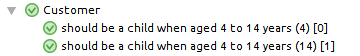
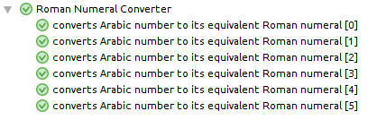
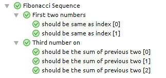

Jasmine-Parameterized
=====================

[](https://travis-ci.org/paucls/jasmine-parameterized)

Parameterized unit tests for Jasmine.

## Installation
```
npm install jasmine-parameterized
```

## Usage
This library provides a convenient `cases` function to easily parameterized the execution of `it` spec functions.

## Examples

### Single parameter
``` ts
import { cases } from 'jasmine-parameterized';

describe('Customer', () => {

    cases([
        4,
        14
    ])
    .it('should be a child when aged 4 to 14 years', (age) => {
        const customer = new Customer(age);
        expect(customer.isChild()).toBe(true);
    });
...
```


### Multiple parameters
``` ts
describe('Roman Numeral Converter', () => {

    cases([
        [1, 'I'],
        [2, 'II'],
        [3, 'III'],
        [4, 'IV'],
        [5, 'V'],
        [6, 'VI']
    ])
    .it('converts Arabic number to its equivalent Roman numeral', ([arabic, roman]) => {
        expect(romanFor(arabic)).toBe(roman);
    });

});
```


### Multiple named parameters
For complex cases or when we want to be more explicit.

``` ts
describe('Fibonacci Sequence', () => {

    describe('First two numbers', () => {
        cases([
            {index: 0, expected: 0},
            {index: 1, expected: 1}
        ])
        .it('should be same as index', ({index, expected}) => {
            expect(fibonacciNumber(index)).toEqual(expected);
        });
    });

    describe('Third number on', () => {
        cases([
            {index: 2, expected: 1},
            {index: 3, expected: 2},
            {index: 5, expected: 5}
        ])
        .it('should be the sum of previous two', ({index, expected}) => {
            expect(fibonacciNumber(index)).toEqual(expected);
        });
    });

});
```

